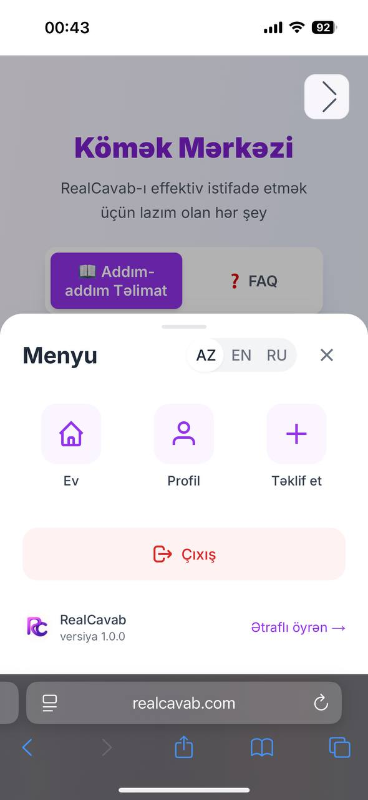
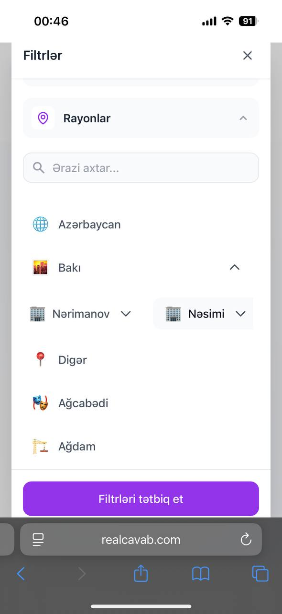
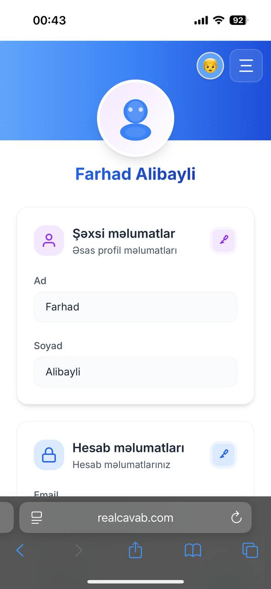
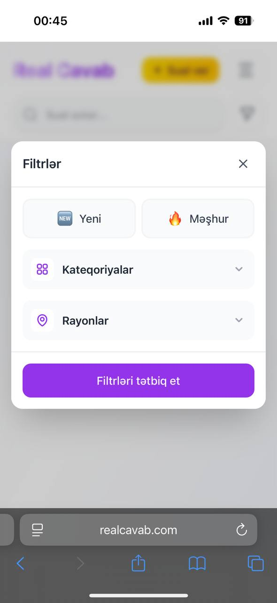
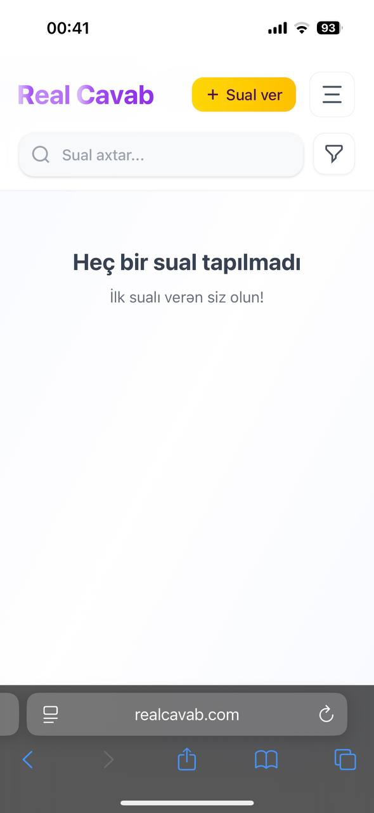

# RealCavab - Skills Showcase

> **A public demonstration of technical skills from a private multilingual Q&A platform**

This repository showcases key technical implementations from **RealCavab**, a sophisticated multilingual Q&A platform built with modern web technologies. While the full application contains proprietary business logic and sensitive user data handling, this showcase highlights my expertise in full-stack development, database design, and scalable architecture.

## 🌐 Visit the Platform

Explore the live platform here: [realcavab.com](https://realcavab.com)

## ✨ Visual Overview

Here are some glimpses of the RealCavab platform:

## 🚀 Project Overview

**RealCavab** is a comprehensive community Q&A platform that supports multiple languages (Azerbaijani, English, Russian) with advanced features including real-time content moderation, intelligent search algorithms, and robust user management systems.

## 🛠️ Technologies Used

### **Languages & Frameworks**
- **TypeScript** - Type-safe JavaScript development
- **Next.js 14** - Full-stack React framework with App Router
- **React 18** - Modern React with hooks and context API

### **Backend & Database**
- **Prisma ORM** - Type-safe database client and migrations
- **MySQL** - Relational database management
- **Node.js** - Server-side JavaScript runtime

### **Frontend & Styling**
- **Tailwind CSS** - Utility-first CSS framework
- **i18next** - Internationalization framework
- **React Context API** - State management

### **Development Tools**
- **Docker** - Containerization
- **Railway** - Deployment platform
- **Git** - Version control

## 🔥 Key Skills Demonstrated

### 1. **Advanced Search Algorithm Implementation**
**Skill:** Multi-language search algorithms with intelligent filtering

**Description:** This implementation demonstrates sophisticated search functionality that intelligently matches user queries across categories and districts in multiple languages (Azerbaijani, English, Russian). The algorithm efficiently handles translation lookups and provides fuzzy matching capabilities.

**File:** [`utils/searchUtils.ts`](utils/searchUtils.ts)

### 2. **RESTful API Design with Content Moderation**
**Skill:** Robust API development with real-time content filtering

**Description:** A comprehensive API endpoint showcasing proper request validation, authentication middleware, real-time content moderation, and database operations. Demonstrates best practices in error handling and response formatting.

**File:** [`app/api/questions/route.ts`](app/api/questions/route.ts)

### 3. **Database Schema Design with ORM**
**Skill:** Complex database modeling with proper relationships and constraints

**Description:** Well-structured Prisma schema demonstrating proper database design patterns, including user management, content relationships, reporting systems, and session handling. Shows expertise in data modeling and relationship management.

**File:** [`prisma/schema.prisma`](prisma/schema.prisma)

### 4. **Content Moderation System**
**Skill:** Multi-language content filtering and censorship algorithms

**Description:** Real-time text filtering system with configurable blacklists for multiple languages. Demonstrates regex pattern matching, case-insensitive searching, and efficient word boundary detection for content moderation.

**File:** [`app/utils/contentModeration.ts`](app/utils/contentModeration.ts)

### 5. **React Component Architecture**
**Skill:** Clean component design with TypeScript and responsive UI

**Description:** Reusable React component demonstrating proper TypeScript usage, state management, responsive design, and accessibility considerations. Shows expertise in modern React patterns and best practices.

**File:** [`app/components/QuestionCard.tsx`](app/components/QuestionCard.tsx)

### 6. **Custom React Hooks & Context Management**
**Skill:** Advanced React state management and custom hooks

**Description:** Custom React context implementation for language management with localStorage persistence. Demonstrates proper context usage, TypeScript integration, and state synchronization across components.

**File:** [`app/context/LanguageContext.tsx`](app/context/LanguageContext.tsx)

### 7. **Utility Functions & Clean Code Practices**
**Skill:** Reusable utility functions and code organization

**Description:** Text processing utilities demonstrating clean code practices, proper error handling, and reusable helper functions. Shows expertise in code organization and maintainability.

**File:** [`app/utils/textUtils.ts`](app/utils/textUtils.ts)

## 📁 Project Structure
├── app/
│ ├── api/ # Next.js API routes
│ ├── components/ # React components
│ ├── utils/ # Utility functions
│ ├── hooks/ # Custom React hooks
│ ├── context/ # React context providers
│ └── types/ # TypeScript type definitions
├── prisma/ # Database schema and migrations
├── i18n/ # Internationalization files
├── lib/ # Library configurations
└── utils/ # Shared utility functions

## ⚠️ Important Note

This repository is a **skills showcase** that demonstrates technical expertise while protecting proprietary business logic. The following elements are intentionally omitted or simplified:

- **Proprietary business rules** and algorithms
- **Complete authentication implementation** details
- **Admin panel functionality** and user management
- **Sensitive user data handling** processes
- **Production configuration** and environment variables
- **Complete database queries** and optimization strategies

The code provided is structured to be educational and demonstrate technical skills while maintaining the confidentiality of the full application.

## 🚀 Key Technical Achievements

- **Multi-language Support**: Implemented comprehensive internationalization with dynamic language switching
- **Content Moderation**: Built real-time filtering system supporting multiple languages
- **Search Optimization**: Developed intelligent search algorithms with fuzzy matching
- **Database Design**: Created scalable schema with proper relationships and constraints
- **API Architecture**: Designed RESTful endpoints with robust error handling
- **Component Reusability**: Built modular React components with TypeScript
- **State Management**: Implemented efficient context-based state management

---

*This repository showcases my expertise in full-stack development, database design, and scalable architecture. The implementations demonstrate real-world problem-solving skills and modern development practices.*  

